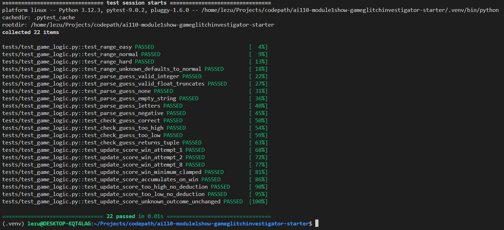

# 🎮 Game Glitch Investigator: The Impossible Guesser

## 🚨 The Situation

You asked an AI to build a simple "Number Guessing Game" using Streamlit.
It wrote the code, ran away, and now the game is unplayable. 

- You can't win.
- The hints lie to you.
- The secret number seems to have commitment issues.

## 🛠️ Setup

1. Install dependencies: `pip install -r requirements.txt`
2. Run the broken app: `python -m streamlit run app.py`

## 🕵️‍♂️ Your Mission

1. **Play the game.** Open the "Developer Debug Info" tab in the app to see the secret number. Try to win.
2. **Find the State Bug.** Why does the secret number change every time you click "Submit"? Ask ChatGPT: *"How do I keep a variable from resetting in Streamlit when I click a button?"*
3. **Fix the Logic.** The hints ("Higher/Lower") are wrong. Fix them.
4. **Refactor & Test.** - Move the logic into `logic_utils.py`.
   - Run `pytest` in your terminal.
   - Keep fixing until all tests pass!

## 📝 Document Your Experience

### Game Purpose
A number guessing game built with Streamlit where the player tries to guess a secret number within a limited number of attempts. Three difficulty levels (Easy, Normal, Hard) control the number range and attempt limit. Each correct guess awards points based on how few attempts were used.

### Bugs Found

| Bug | Location | Description |
|-----|----------|-------------|
| Backwards hints | `check_guess` | "Go HIGHER!" and "Go LOWER!" were swapped — hints sent players in the wrong direction |
| Secret cast to string on even attempts | `app.py` | On every even-numbered attempt, the secret was silently converted to a string, breaking numeric comparison (e.g. `"100" < "16"` alphabetically) |
| Wrong guesses deducted points | `update_score` | "Too High" and "Too Low" outcomes each deducted 5 points, causing negative scores before a win could recover them |
| Score formula off by 2 | `update_score` | Formula used `attempt_number + 1` instead of `attempt_number - 1`, under-rewarding every win by 20 points |
| Score not reset on new game | `app.py` | Starting a new game preserved the previous score, causing points to accumulate across sessions |
| Attempts initialized to 1 | `app.py` | First page load showed one fewer attempt remaining than the difficulty allowed |
| Attempt counter one step behind | `app.py` | Counter incremented after the display rendered, so the "Attempts left" value was always stale by one |
| Debug info rendered too early | `app.py` | Developer Debug Info block rendered before guess processing, so history never showed the current guess — the first guess never appeared |
| Enter key didn't submit | `app.py` | Text input was outside a `st.form`, so pressing Enter had no effect |

### Fixes Applied

- Removed the `str()` cast on even attempts so comparisons are always numeric
- Removed 5-point deductions for wrong guesses; the win formula already penalizes extra attempts
- Fixed score formula from `100 - 10 * (attempt_number + 1)` to `100 - 10 * (attempt_number - 1)`
- Added `st.session_state.score = 0` to the new game handler
- Changed attempts initialization from `1` to `0`
- Moved attempt increment to `on_click=_increment_attempts` on the submit button so it fires before the script rerenders
- Moved the Developer Debug Info expander to after the `if submit:` block so all session state reflects the current guess
- Wrapped the text input in `st.form` so pressing Enter submits the guess

## 📸 Demo

### Pytest Results — 22 Tests Passing

## 🚀 Stretch Features

- [ ] [If you choose to complete Challenge 4, insert a screenshot of your Enhanced Game UI here]
